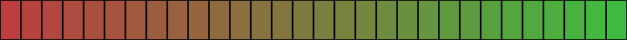
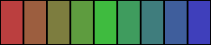
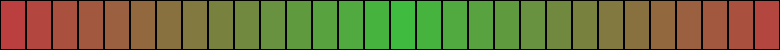

#################################################
color-utils-js
#################################################

.. contents:: :depth: 2
.. section-numbering:: :depth: 2

=================================================
Color Formats
=================================================
The goal is to allow the color specifications allowed in CSS for ease of use.
However that is still some way of and now the formats supported are the following.

Functional notation
=================================================
+------------------+-----------------------------------------------------------+---------+
| Notation         | Description                                               | Weight  |
+===========+======+===========================================================+=========+
| rgb(R, G, B)     | Each value ``R(ed)``, ``G(reen)`` and ``B(lue)``          | 0       |
|                  | is an integer between 0 and 255.                          |         |
+------------------+-----------------------------------------------------------+---------+
| rgba(R, G, B, A) | Same as ``rgb()`` but with an additional ``Alpha`` value. | 1       |
|                  | The alpha value is a decimal number between 0 and 1.      |         |
+------------------+-----------------------------------------------------------+---------+

Hexadecimal notation
=================================================
+------------------+-----------------------------------------------------------+---------+
| Notation         | Description                                               | Weight  |
+==================+===========================================================+=========+
| #RRGGBB          | Where each pair of ``R(ed)``, ``G(reen)`` and ``B(lue)``  | 0       |
|                  | is an integer between 0 and 255 represented by            |         |
|                  | hexadecimal (base 16). Values are given as pairs          |         |
|                  | therefore single digit values need to be padded with      |         |
|                  | leading zero.                                             |         |
|                  |                                                           |         |
|                  | **Examples**, decimal values to the left and their        |         |
|                  | hexadecimal translation to the right: ``255 = FF``,       |         |
|                  | ``0 = 00`` and ``10 = 0A``.                               |         |
+------------------+-----------------------------------------------------------+---------+
| #RRGGBBAA        | Same as ``#RRGGBB`` but with an additional pair for       | 1       |
|                  | ``Alpha``. Alpha follows the same convention as           |         |
|                  | the other values.                                         |         |
+------------------+-----------------------------------------------------------+---------+
| #RGB             | Shorter version of ``#RRGGBB`` where each values is       | 0       |
|                  | expanded.                                                 |         |
|                  |                                                           |         |
|                  | **Example**: ``#B03`` is equal to ``#BB0033``.            |         |
+------------------+-----------------------------------------------------------+---------+
| #RGBA            | Shorter version of ``#RRGGBBAA`` where each values is     | 1       |
|                  | expanded.                                                 |         |
|                  |                                                           |         |
|                  | **Example**: ``#9F08`` is equal to ``#99FF0088``.         |         |
+------------------+-----------------------------------------------------------+---------+

=================================================
Methods
=================================================

Lerp
=================================================
Generate a color that is a blend between two colors using linear interpolation.

Signature
-------------------------------------------------
::

    ColorUtils.lerp(first, second, blend)

Parameters
-------------------------------------------------
+-----------+-------------+----------------------------------------------------+
| Name      | Type        | Description                                        |
+===========+=============+====================================================+
| start     | string      | Start color in the transition.                     |
|           |             | Information about supported `Color Formats`_       |
+-----------+-------------+----------------------------------------------------+
| end       | string      | End color in the transition.                       |
|           |             | Information about supported `Color Formats`_       |
+-----------+-------------+----------------------------------------------------+
| blend     | float       | Specifies how much of each color should be used.   |
|           |             | Blend ``0`` will return the start value.           |
|           |             | Respectively ``1`` will return the end color.      |
|           |             | A even blend is achieved using ``0.5``.            |
+-----------+-------------+----------------------------------------------------+

Returns
-------------------------------------------------
+-------------+--------------------------------------------------------------------------------------------------------+
| Type        | Description                                                                                            |
+-------------+--------------------------------------------------------------------------------------------------------+
| string      | A new color that is a blend between the colors specified as ``start`` and ``end``.                     |
+-------------+--------------------------------------------------------------------------------------------------------+

Notes
-------------------------------------------------
The start and end colors may be entered using different color formats.
The returned collection will however only consist of one color format.
What format is chosen is based on the weight of the formats used.
The weight that is the heaviest will selected primarily.
If weights are equal the one that occurs will take precedence.
Information about each formats weight you can find under the section `Color Formats`_.

Example
-------------------------------------------------
Code
+++++++++++++++++++++++++++++++++++++++++++++++++
.. code:: javascript

    var red = "#bb3f3f";
    var green = "#3fbb3f";
    var blend = 0.5;
    var color = ColorUtils.lerp(red, green, blend);

Result
+++++++++++++++++++++++++++++++++++++++++++++++++
::

    #7d7d3f

Transition
=================================================
Generate a list of colors that transitions between two colors. Could also be described as a linear gradient.

Signature
-------------------------------------------------
::

    ColorUtils.loop(first, second, steps)

Parameters
-------------------------------------------------
+-----------+-------------+----------------------------------------------------+
| Name      | Type        | Description                                        |
+===========+=============+====================================================+
| start     | string      | Start color in the transition.                     |
|           |             | Information about supported `Color Formats`_       |
+-----------+-------------+----------------------------------------------------+
| end       | string      | End color in the transition.                       |
|           |             | Information about supported `Color Formats`_       |
+-----------+-------------+----------------------------------------------------+
| steps     | int         | The total number of colors generated for the       |
|           |             | transition, start and end colors included.         |
|           |             | The values has to be 2 or greater.                 |
+-----------+-------------+----------------------------------------------------+

Returns
-------------------------------------------------
+-------------+--------------------------------------------------------------------------------------------------------+
| Type        | Description                                                                                            |
+-------------+--------------------------------------------------------------------------------------------------------+
| array       | Collection of colors in string format creating a gradient from ``start`` to ``end`` color.             |
|             | The length of the collection will be equal to the number of ``steps`` specified.                       |
|             | Position 0 in the collection will be equal to the ``start`` color and position ``steps - 1``           |
|             | will be equal to the ``end`` color.                                                                    |
+-------------+--------------------------------------------------------------------------------------------------------+

Notes
-------------------------------------------------
The start and end colors may be entered using different color formats.
The returned collection will however only consist of one color format.
What format is chosen is based on the weight of the formats used.
The weight that is the heaviest will selected primarily.
If weights are equal the one that occurs will take precedence.
Information about each formats weight you can find under the section `Color Formats`_.

Example
-------------------------------------------------
Code
+++++++++++++++++++++++++++++++++++++++++++++++++
.. code:: javascript

    var red = "#bb3f3f";
    var green = "rgb(63, 187, 63)";
    var steps = 30;
    var transition = ColorUtils.transition(red, green, steps);

Result
+++++++++++++++++++++++++++++++++++++++++++++++++
::

    [ #bb3f3f, #b7433f, #b2483f, #ae4c3f, #aa503f,
      #a6543f, #a1593f, #9d5d3f, #99613f, #95653f,
      #906a3f, #8c6e3f, #88723f, #83773f, #7f7b3f,
      #7b7f3f, #77833f, #72883f, #6e8c3f, #6a903f,
      #65953f, #61993f, #5d9d3f, #59a13f, #54a63f,
      #50aa3f, #4cae3f, #48b23f, #43b73f, #3fbb3f ]

Textual presentation of the colors stored in the variable ``transition`` after execution.

Visual presentation of the colors stored in the variable ``transition`` after execution.

Transitions
=================================================
Generate a list of colors that transitions between multiple colors. Could also be described as a linear gradient.

Signature
-------------------------------------------------
::

    ColorUtils.transitions(colors, steps)

Parameters
-------------------------------------------------
+-----------+-------------+----------------------------------------------------+
| Name      | Type        | Description                                        |
+===========+=============+====================================================+
| colors    | array       | Collection of strings describing the colors that   |
|           |             | should be transitioned. Order of the collection    |
|           |             | will be the order or transition.                   |
|           |             | Information about supported `Color Formats`_       |
+-----------+-------------+----------------------------------------------------+
| steps     | int         | The total number of colors generated for the       |
|           |             | transition, each color in the specified            |
|           |             | collection included.                               |
|           |             | The values has to be at least the length of        |
|           |             | the collection.                                    |
+-----------+-------------+----------------------------------------------------+

Returns
-------------------------------------------------
+-------------+--------------------------------------------------------------------------------------------------------+
| Type        | Description                                                                                            |
+-------------+--------------------------------------------------------------------------------------------------------+
| array       | Collection of colors in string format creating a gradient between each color specified in ``colors``.  |
|             | The length of the collection will be equal to the number of ``steps`` specified.                       |
|             | Position 0 in the collection will be equal to the first color in ``colors`` and position ``steps - 1`` |
|             | will be equal to the last color im ``colors``.                                                         |
+-------------+--------------------------------------------------------------------------------------------------------+

Notes
-------------------------------------------------
The colors may be entered using different color formats.
The returned collection will however only consist of one color format.
What format is chosen is based on the weight of the formats used.
The weight that is the heaviest will selected primarily.
If weights are equal the one that occurs will take precedence.
Information about each formats weight you can find under the section `Color Formats`_.

Example
-------------------------------------------------
Code
+++++++++++++++++++++++++++++++++++++++++++++++++
.. code:: javascript

    var red = "#bb3f3f";
    var green = "#3fbb3f";
    var blue = "rgba(63, 63, 187, 1)";
    var colors = [red, green, blue];
    var steps = 9;
    var transitions = ColorUtils.transitions(colors, steps);

Result
+++++++++++++++++++++++++++++++++++++++++++++++++
::

    [ rgba(187, 63, 63, 1.000), rgba(156, 94, 63, 1.000), rgba(125, 125, 63, 1.000),
      rgba(94, 156, 63, 1.000), rgba(63, 187, 63, 1.000), rgba(63, 156, 94, 1.000),
      rgba(63, 125, 125, 1.000), rgba(63, 94, 156, 1.000), rgba(63, 63, 187, 1.000) ]

Textual presentation of the colors stored in the variable ``transitions`` after execution.

Visual presentation of the colors stored in the variable ``transitions`` after execution.

Loop
=================================================
Generate a list of colors that loops between two colors.
Can be used for a constant rotation between two colors.

Signature
-------------------------------------------------
::

    ColorUtils.transitions(colors, steps)

Parameters
-------------------------------------------------
+-----------+-------------+----------------------------------------------------+
| Name      | Type        | Description                                        |
+===========+=============+====================================================+
| first     | string      | First color in the transition.                     |
|           |             | Information about supported `Color Formats`_       |
+-----------+-------------+----------------------------------------------------+
| second    | string      | Second color in the transition.                    |
|           |             | Information about supported `Color Formats`_       |
+-----------+-------------+----------------------------------------------------+
| steps     | int         | The total number of colors generated for the       |
|           |             | transition, each color in the specified            |
|           |             | collection included.                               |
|           |             | The values has to be at least the length of        |
|           |             | the collection.                                    |
+-----------+-------------+----------------------------------------------------+

Returns
-------------------------------------------------
+-------------+--------------------------------------------------------------------------------------------------------+
| Type        | Description                                                                                            |
+-------------+--------------------------------------------------------------------------------------------------------+
| array       | Collection of colors in string format creating a loop between ``first`` to ``second`` color.           |
|             | With two transitions, one from ``first`` to ``second`` and then one that does the reverse.             |
|             | The length of the collection will be equal to the number of ``steps`` specified.                       |
+-------------+--------------------------------------------------------------------------------------------------------+

Notes
-------------------------------------------------
The specified colors will only be present once in the loop.
No repetition of color means that it will become a smooth rotation when looped.

The colors may be entered using different color formats.
The returned collection will however only consist of one color format.
What format is chosen is based on the weight of the formats used.
The weight that is the heaviest will selected primarily.
If weights are equal the one that occurs will take precedence.
Information about each formats weight you can find under the section `Color Formats`_.

Example
-------------------------------------------------
Code
+++++++++++++++++++++++++++++++++++++++++++++++++
.. code:: javascript

    var red = "#bb3f3f";
    var green = "#3fbb3f";
    var steps = 30;
    var loop = ColorUtils.loop(red, green, steps);

Result
+++++++++++++++++++++++++++++++++++++++++++++++++
::

    [ #bb3f3f, #b3473f, #aa503f, #a2583f, #9a603f,
      #92683f, #89713f, #81793f, #79813f, #71893f,
      #68923f, #609a3f, #58a23f, #50aa3f, #47b33f,
      #3fbb3f, #47b33f, #50aa3f, #58a23f, #609a3f,
      #68923f, #71893f, #79813f, #81793f, #89713f,
      #92683f, #9a603f, #a2583f, #aa503f, #b3473f ]

Textual presentation of the colors stored in the variable ``loop`` after execution.

Visual presentation of the colors stored in the variable ``loop`` after execution.
